# Comparaison des approches de classification et démarche MLOps

_Auteur : JEAN BAPTISTE Joëlle_  
_Date : Avril 2025_

---

## Table des matières

- [Introduction](#introduction)
- [Présentation et comparaison des modèles](#présentation-et-comparaison-des-modèles)
  - [Modèle sur mesure simple](#modèle-sur-mesure-simple)
  - [Modèle sur mesure avancé](#modèle-sur-mesure-avancé)
  - [Modèle avancé BERT](#modèle-avancé-bert)
- [Démarche MLOps mise en œuvre](#démarche-mlops-mise-en-œuvre)
  - [Principes généraux](#principes-généraux)
  - [Cycle MLOps du projet](#cycle-mlops-du-projet)
  - [Suivi des expérimentations](#suivi-des-expérimentations)
  - [Tests unitaires](#tests-unitaires)
  - [Architecture applicative déployée sur Azure](#architecture-applicative-déployée-sur-azure)
  - [Déploiement de l’API](#déploiement-de-lapi)
  - [Interface front de test (locale)](#interface-front-de-test-locale)
  - [Monitoring et alertes](#monitoring-et-alertes)
- [Proposition de démarche pour l'amélioration continue du modèle](#proposition-de-démarche-pour-lamélioration-continue-du-modèle)
- [Conclusion](#conclusion)

---

### 🔗 Liens vers les dépôts du projet

- 💻 **Backend (API FastAPI + modèle TFLite + déploiement Azure)**  
  [https://github.com/joelle-jnbaptiste/Analyse_Sentiments](https://github.com/joelle-jnbaptiste/Analyse_Sentiments)

- 🧪 **Frontend (Interface de test locale en Streamlit)**  
  [https://github.com/joelle-jnbaptiste/FrontAnalyseSentiment](https://github.com/joelle-jnbaptiste/FrontAnalyseSentiment)

---

## Introduction

Dans le cadre de ce projet, nous avons conçu et comparé plusieurs approches de classification de sentiments afin d'évaluer leur pertinence en situation réelle.  
L’objectif était double : évaluer les performances de différents types de modèles — du plus simple au plus avancé — et mettre en place une démarche MLOps complète garantissant un suivi, une reproductibilité et une amélioration continue du modèle en production.

Trois approches ont été étudiées :

- Un modèle sur mesure simple, basé sur des techniques classiques de vectorisation et de classification.
- Un modèle sur mesure avancé, intégrant des méthodes d’apprentissage plus complexes.
- Un modèle avancé basé sur BERT, une architecture de type Transformer pré-entraînée, convertie ici au format TFLite pour faciliter son déploiement.

Pour accompagner ces expérimentations, une architecture orientée MLOps a été mise en place, intégrant le tracking des modèles via MLflow, le déploiement via Docker et Azure Container Apps, ainsi que le monitoring et les alertes via Azure Application Insights.

Ce document présente la démarche, les résultats de comparaison des modèles et la manière dont les principes MLOps ont été appliqués à ce projet.

---

## Présentation et comparaison des modèles

### Objectif de la modélisation

L’objectif de cette étape est d’identifier le modèle d’apprentissage supervisé le plus performant pour la tâche de classification binaire à partir de données textuelles. Plusieurs familles de modèles ont été testées afin d’évaluer différentes approches de représentation des données (vectorisation) et de modélisation (modèles classiques, réseaux de neurones profonds, modèles préentraînés).

Pour cela, nous avons entraîné :

- des modèles **classiques**, comme la **régression logistique** utilisant une vectorisation **TF-IDF** ;
- des modèles **de deep learning**, tels que des réseaux de neurones **LSTM**, **CNN** et des architectures **hybrides CNN-LSTM**, combinés à des embeddings entraînés de type **Word2Vec** ou **FastText** ;
- un modèle de **type transformer**, en l’occurrence **BERT**, préentraîné sur un large corpus puis fine-tuné sur notre jeu de données, afin de tester l’apport d’une compréhension contextuelle avancée du texte.

L’évaluation porte non seulement sur la performance globale (précision, rappel, f1-score), mais également sur la capacité des modèles à généraliser, la stabilité des prédictions et le taux d’erreur sur les classes minoritaires. Cela permet de faire un choix éclairé en tenant compte des compromis entre complexité, efficacité et robustesse du modèle.

### Modèles explorés

Afin de comparer différentes approches de classification sur des données textuelles, plusieurs types de modèles ont été sélectionnés. Le choix s’est porté sur des architectures variées, allant des plus simples aux plus sophistiquées, afin d’évaluer à la fois la performance, la capacité de généralisation et la complexité de mise en œuvre.

#### Modèles classiques

- **Régression logistique** : utilisée comme **modèle de référence**, elle a été entraînée sur des données vectorisées avec l’approche **TF-IDF**. Ce modèle simple permet d’établir une baseline solide, rapide à entraîner et facile à interpréter.

#### Réseaux de neurones séquentiels

- **LSTM** : les modèles à mémoire courte longue durée sont utilisés pour capturer les dépendances dans les séquences de mots. Plusieurs variantes ont été testées, avec des embeddings **Word2Vec** et **FastText**, associés à différents prétraitements (lemmatisation, suppression des stopwords...).

#### Réseaux convolutionnels

- **CNN** : initialement développés pour le traitement d’images, les réseaux convolutifs ont également démontré de bonnes performances sur les textes, notamment pour détecter des motifs locaux. Les modèles CNN ont été évalués avec différents types d’embeddings.

#### Architectures hybrides

- **CNN-LSTM** : ce modèle combine les avantages des convolutions (détection locale de motifs) et des LSTM (compréhension du contexte global) pour améliorer la capture de la structure des séquences textuelles.

#### Modèle préentraîné de type transformer

- **BERT** : nous avons fine-tuné un modèle **BERT (Bidirectional Encoder Representations from Transformers)** sur notre jeu de données. Ce type de modèle est capable de capturer des relations contextuelles riches entre les mots dans un texte, et constitue aujourd’hui l’état de l’art en NLP.

Chaque modèle a été testé avec des variantes de prétraitement pour évaluer l’impact de la lemmatisation, de la suppression des stopwords, ou encore du type d’embedding utilisé.

### Prétraitement appliqué

Avant l'entraînement des modèles, un travail de nettoyage et de transformation du texte a été effectué afin d’améliorer la qualité des représentations et la performance des modèles. Plusieurs configurations ont été testées afin d’évaluer leur impact.

#### Nettoyage du texte

Les opérations suivantes ont été appliquées de manière systématique :

- Conversion en minuscules
- Suppression de la ponctuation et des caractères spéciaux
- Suppression des URLs et mentions (si présentes)

#### Lemmatisation et suppression des stopwords

Deux versions principales du corpus ont été utilisées :

- Une version **lemmatisée**, où chaque mot est réduit à sa forme canonique (ex. "mangeaient" → "manger") ;
- Une version avec ou sans **stopwords** (mots fréquents comme "le", "et", "est", souvent peu informatifs).

#### Représentation vectorielle

Plusieurs techniques d’encodage du texte ont été explorées :

- **TF-IDF (Term Frequency – Inverse Document Frequency)** : utilisée avec la régression logistique, cette méthode permet de transformer chaque texte en vecteur numérique basé sur la fréquence des mots pondérée par leur rareté.

- **Word embeddings statiques** :
  - **Word2Vec** : capture des relations sémantiques entre les mots à partir de leurs contextes locaux.
  - **FastText** : améliore Word2Vec en prenant en compte les sous-mots, ce qui permet une meilleure gestion des mots rares ou mal orthographiés.

Ces embeddings ont été soit entraînés en amont sur un corpus externe, soit importés depuis des modèles préentraînés disponibles publiquement.

- **BERT tokenizer** : pour le modèle BERT, les textes ont été encodés via le tokenizer officiel, qui découpe les phrases en **WordPieces** et ajoute les **tokens spéciaux** ([CLS], [SEP], etc.) requis pour le traitement par le modèle transformer.

L’ensemble des modèles a ainsi été testé avec différentes combinaisons : avec ou sans lemmatisation, avec ou sans stopwords, et selon le type d’embedding utilisé. Ces variations permettent d’analyser leur influence sur la performance finale.

### Métriques d’évaluation

Afin de comparer efficacement les performances des modèles de classification, plusieurs métriques ont été sélectionnées. Elles permettent d’évaluer non seulement la précision globale, mais aussi la qualité des prédictions pour chacune des classes, en particulier dans un contexte de déséquilibre éventuel.

#### Accuracy

L’**accuracy** mesure la proportion globale de bonnes prédictions. Bien qu’intuitive, cette métrique peut être trompeuse lorsque les classes sont déséquilibrées.

#### F1-score

Le **f1-score** est la moyenne harmonique entre la précision (precision) et le rappel (recall). C’est une métrique particulièrement adaptée lorsque l’on cherche un compromis entre les **faux positifs** et les **faux négatifs**. Elle a été utilisée comme **métrique principale de comparaison** entre les modèles.

#### Recall (sensibilité)

Le **recall** indique la capacité du modèle à détecter les exemples positifs. Il est crucial lorsque l’objectif est de **limiter les faux négatifs**, par exemple pour ne pas rater des cas importants à détecter.

#### Precision

La **precision** mesure la proportion de vrais positifs parmi toutes les prédictions positives. Elle est importante lorsque l’on cherche à **limiter les faux positifs**.

#### ROC AUC

Le **ROC AUC (Receiver Operating Characteristic - Area Under Curve)** évalue la capacité du modèle à séparer les classes, indépendamment du seuil de décision. Une valeur proche de 1 indique une excellente capacité de séparation.

#### Log Loss

La **log loss** (ou perte logarithmique) prend en compte la **probabilité** associée à chaque prédiction. Plus les prédictions sont proches de la réalité avec des scores de confiance élevés, plus la log loss est faible. Cette métrique est utile pour évaluer la **calibration** du modèle.

#### Autres métriques suivies

- **Standard deviation de confiance (`confidence_std`)** : permet d’évaluer la **stabilité des prédictions** entre les exemples.
- **Nombre de faux positifs / faux négatifs** : pour une interprétation plus directe des erreurs.

Ces différentes métriques ont été enregistrées pour chaque modèle testé, via **MLflow**, afin d’assurer une traçabilité et une comparaison fine des performances.

### Comparaison des résultats

#### Dummy Classifier – Modèle de référence naïf

Le **Dummy Classifier** a été utilisé comme **modèle de référence minimal**. Il ne repose sur aucune analyse du contenu textuel, mais prédit systématiquement la même classe, ici la classe majoritaire. Ce type de modèle permet d’établir un point de comparaison de base, afin de s’assurer que les modèles plus complexes apportent une réelle valeur ajoutée.

Sans surprise, ses performances sont équivalentes au hasard :

- `f1_score = 0.50`
- `accuracy = 0.50`
- `recall = 0.50`
- `precision = 0.50`
- `roc_auc = 0.50`

La matrice de confusion montre que le modèle **prédit uniquement la classe positive**, ignorant totalement la classe négative. Cela entraîne **751 faux positifs** et **750 vrais positifs**, mais **aucune capacité de discrimination**.

De plus, la courbe ROC confirme ce constat, avec une AUC de 0.50, ce qui signifie que le modèle ne fait **aucune distinction** entre les classes.

_Illustration – Matrice de confusion du Dummy Classifier :_
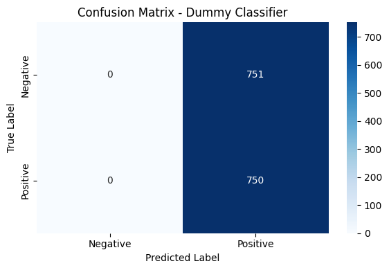

_Illustration – Courbe ROC du Dummy Classifier :_  
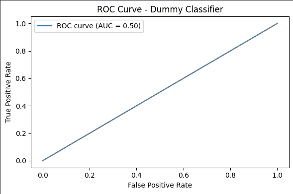

Ce modèle, bien que totalement inadapté à une tâche réelle de classification, est un **point de départ essentiel** pour évaluer les améliorations apportées par les modèles plus avancés.

#### TF-IDF + Régression Logistique

Le modèle basé sur une **régression logistique** utilisant une vectorisation **TF-IDF** constitue une approche classique et robuste pour la classification de texte. Il agit comme un bon compromis entre performance, rapidité d'entraînement et interprétabilité.

Les résultats obtenus sont nettement supérieurs à ceux du modèle de référence (Dummy) :

- `f1_score = 0.73`
- `accuracy = 0.72`
- `precision = 0.70`
- `recall = 0.75`
- `roc_auc = 0.79`
- `log_loss = 0.56`
- `confidence_std = 0.21`
- `faux négatifs = 186`
- `faux positifs = 237`

La **matrice de confusion** montre que le modèle est capable de correctement identifier une grande majorité d'exemples positifs et négatifs. On observe un **équilibre raisonnable entre rappel et précision**, même si le nombre de faux positifs reste conséquent.

_Illustration – Matrice de confusion du modèle TF-IDF + LogReg :_  
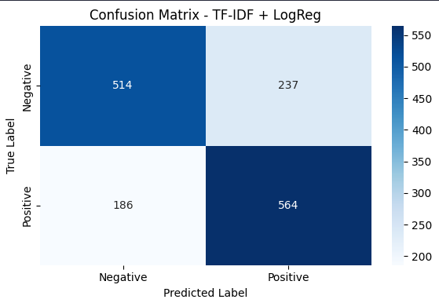

_Illustration – Courbe ROC :_  
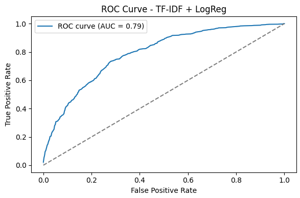

Ce modèle démontre qu'une approche simple, bien paramétrée, peut déjà fournir de très bons résultats. Il constitue un excellent **baseline "fort"** à comparer aux modèles de deep learning plus coûteux à entraîner.

#### LSTM

Le modèle **LSTM** (Long Short-Term Memory) est une architecture de réseau de neurones récurrent bien adaptée aux séquences textuelles. Dans cette version, nous avons utilisé des embeddings **Word2Vec** sur des textes **lemmatisés sans stopwords**, afin de simplifier la représentation sémantique tout en conservant le sens des mots importants.

Les performances observées restent **modestes** malgré une architecture plus complexe :

- `f1_score = 0.61`
- `accuracy = 0.54`
- `recall = 0.71`
- `precision = 0.53`
- `roc_auc = 0.58`
- `log_loss = 0.68`
- `confidence_std = 0.05`
- `faux négatifs = 214`
- `faux positifs = 474`

L’**amélioration du rappel** montre que le modèle est plus apte à détecter les exemples positifs, mais au prix d’un **nombre élevé de faux positifs**. Cela reflète un certain déséquilibre dans la prise de décision, peut-être dû à une généralisation insuffisante ou à un surapprentissage sur certains motifs peu discriminants.

_Illustration – Matrice de confusion :_  


_Illustration – Courbe ROC :_  
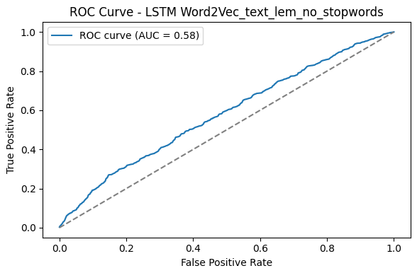

_Illustration – Récapitulatif complet dans MLflow :_  
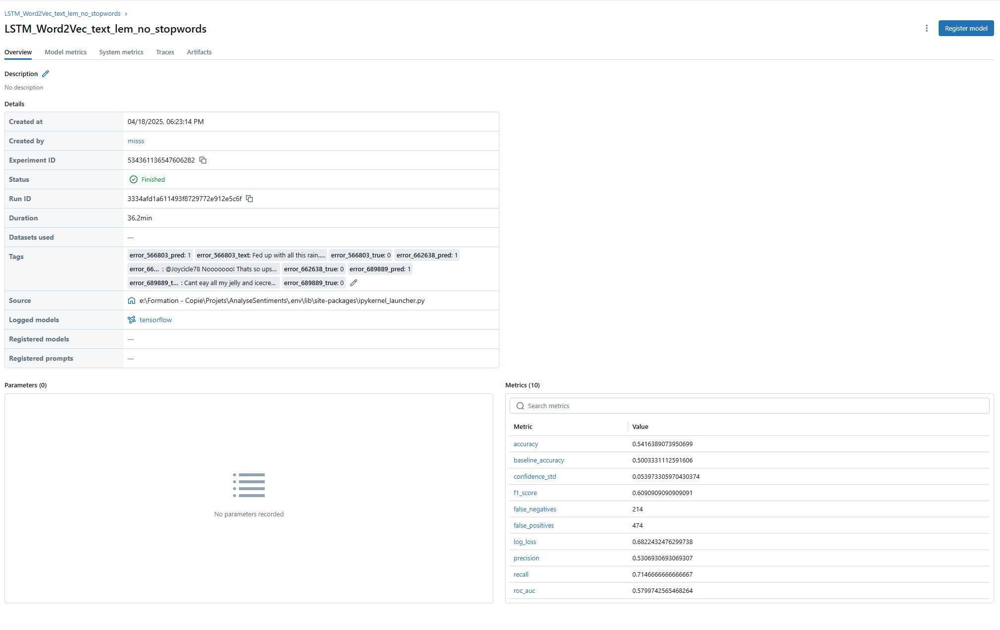

_Illustration – Comparaison des modèles dans MLflow (1/2) :_  
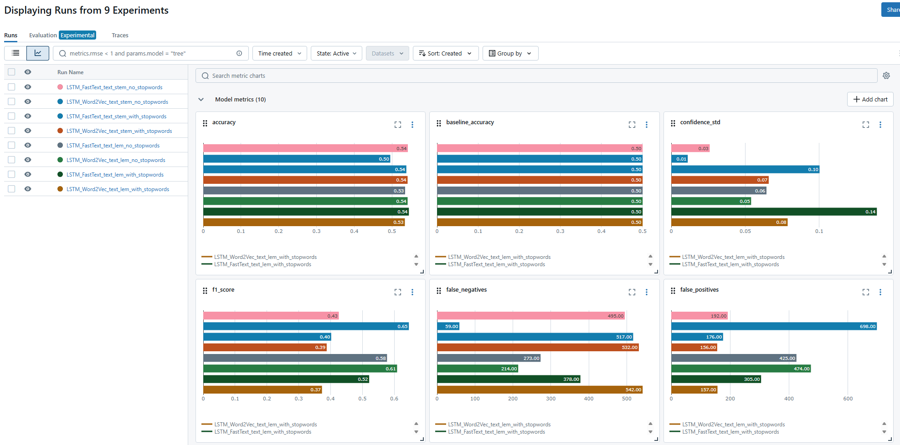

_Illustration – Comparaison des modèles dans MLflow (2/2) :_  
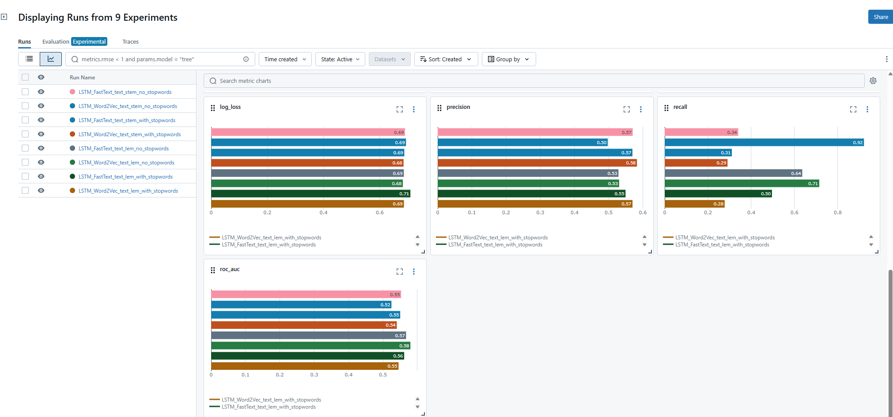

Bien que ce LSTM capte partiellement les dynamiques temporelles du texte, il **reste limité** en performance par rapport aux modèles classiques comme la régression logistique, et encore plus par rapport aux architectures transformers comme BERT.

#### CNN

Le modèle **CNN** (Convolutional Neural Network) est une architecture initialement conçue pour les images, mais qui s’est révélée efficace pour les textes en capturant des **motifs locaux** à travers des filtres convolutifs. Dans cette configuration, il s’appuie sur des **embeddings Word2Vec** extraits de textes **lemmatisés sans stopwords**, permettant une représentation compacte et significative des séquences.

Les performances du modèle CNN se révèlent **solides**, surpassant les LSTM sur plusieurs points :

- `f1_score = 0.63`
- `accuracy = 0.59`
- `recall = 0.68`
- `precision = 0.58`
- `roc_auc = 0.64`
- `log_loss = 0.74`
- `confidence_std = 0.25`
- `faux négatifs = 240`
- `faux positifs = 369`

Avec un **rappel élevé** et une **précision équilibrée**, le modèle démontre une bonne capacité à identifier les exemples positifs, tout en conservant une modération sur les fausses alertes. Le score AUC à 0.64, bien au-dessus du hasard, confirme sa capacité à distinguer les classes. Toutefois, la log loss relativement élevée indique une certaine incertitude dans ses prédictions.

_Illustration – Matrice de confusion :_  


_Illustration – Courbe ROC :_  
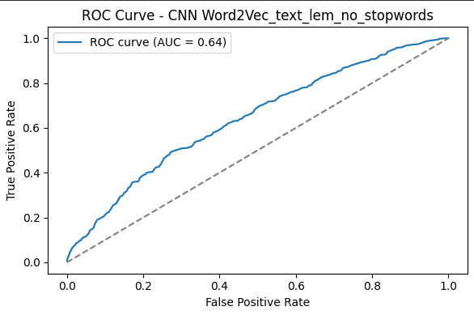

_Illustration – Récapitulatif complet dans MLflow :_  
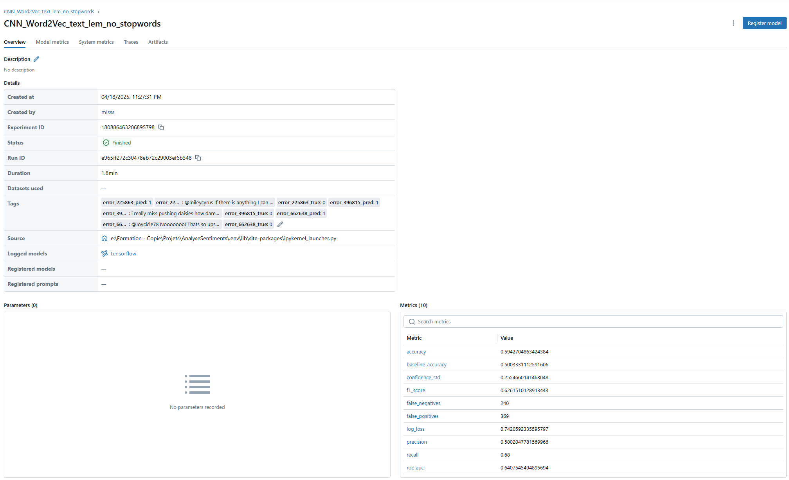

_Illustration – Comparaison des modèles dans MLflow (1/2) :_  
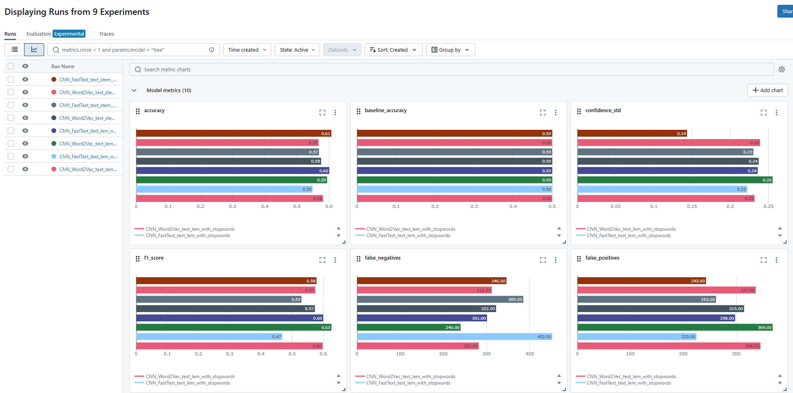

_Illustration – Comparaison des modèles dans MLflow (2/2) :_  
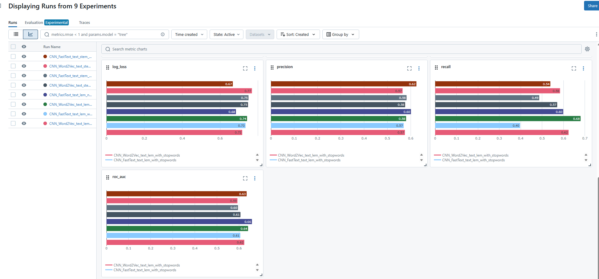

Grâce à sa structure simple mais efficace, le **CNN Word2Vec** représente une alternative intéressante, surtout dans les contextes où l’on cherche un bon équilibre entre performance et rapidité d'entraînement.

#### CNN + LSTM + FastText (racine sans stopwords)

Dans cette dernière configuration, nous avons fusionné deux approches complémentaires : les **réseaux convolutifs (CNN)**, capables de détecter des motifs locaux (comme des expressions clés), et les **réseaux LSTM**, plus adaptés aux dépendances longues dans le texte. Les textes ont été transformés via des embeddings **FastText**, après un **stemming** et suppression des **stopwords**, afin d’obtenir une représentation dense et généralisable.

Cependant, malgré la sophistication de l’architecture, les performances globales restent **décevantes**, proches d’un comportement aléatoire :

- `f1_score = 0.58`
- `accuracy = 0.49`
- `recall = 0.70`
- `precision = 0.50`
- `roc_auc = 0.52`
- `log_loss = 0.69`
- `confidence_std = 0.01`
- `faux négatifs = 223`
- `faux positifs = 532`

On observe un **déséquilibre marqué** dans les prédictions positives, avec un nombre élevé de faux positifs. La courbe ROC quasiment diagonale confirme l’**absence de pouvoir discriminant** du modèle. Cette contre-performance peut résulter d’un **apprentissage peu convergent** dû à la complexité du modèle, à un surajustement rapide ou à une combinaison peu harmonieuse entre les deux architectures.

_Illustration – Matrice de confusion :_  
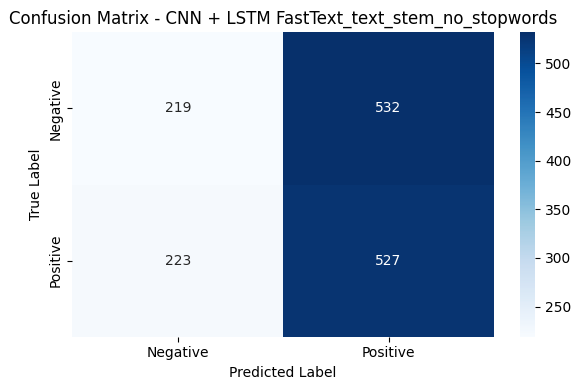

_Illustration – Courbe ROC :_  
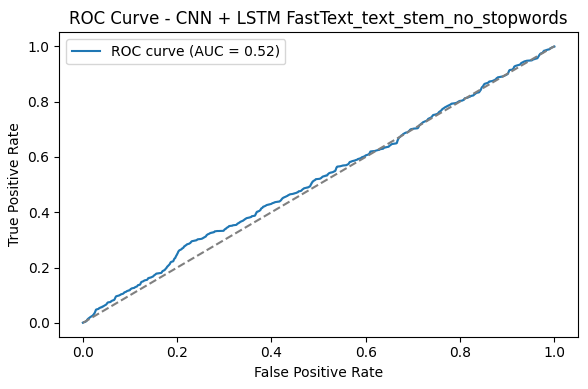

_Illustration – Récapitulatif complet dans MLflow :_  
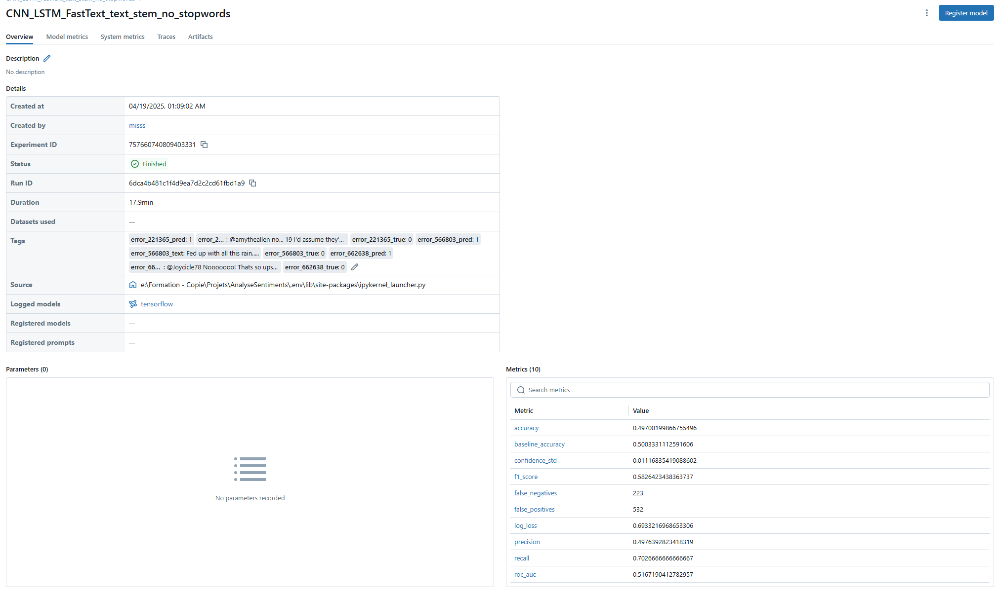

_Illustration – Comparaison des modèles dans MLflow (1/2) :_  
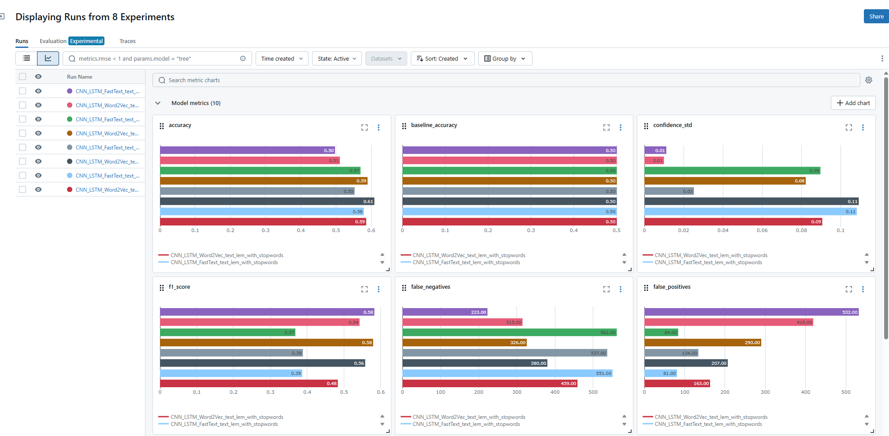

_Illustration – Comparaison des modèles dans MLflow (2/2) :_  
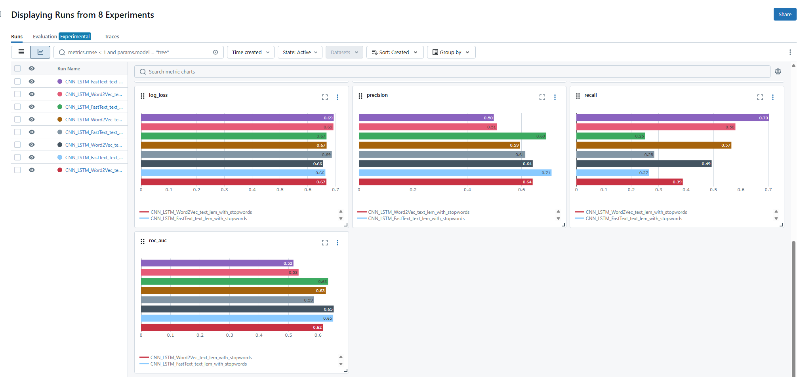

Cette expérience montre que la **complexité d’un modèle ne garantit pas nécessairement de meilleures performances**, surtout si la phase de réglage (hyperparamètres, régularisation, taille des données) n’est pas suffisamment poussée.

#### DistilBERT

Le modèle **DistilBERT** est une version allégée du modèle BERT, pré-entraînée pour capturer les représentations sémantiques profondes du langage naturel. Il bénéficie d’un apprentissage supervisé par distillation à partir de BERT, ce qui lui permet de conserver de très bonnes performances tout en étant plus léger et plus rapide à entraîner.

Ce modèle se démarque nettement des précédents en offrant **les meilleures performances** de tous les modèles testés :

- `f1_score = 0.78`
- `accuracy = 0.79`
- `recall = 0.76`
- `precision = 0.81`
- `roc_auc = 0.87`
- `log_loss = 0.68`
- `confidence_std = 0.45`
- `faux négatifs = 183`
- `faux positifs = 137`

Il présente un excellent équilibre entre **précision** et **rappel**, tout en affichant un score AUC élevé, ce qui montre une capacité robuste à distinguer les classes. En revanche, la variance de confiance (`confidence_std`) plus élevée pourrait indiquer une plus grande sensibilité aux exemples ambigus ou atypiques du jeu de test.

_Illustration – Matrice de confusion :_  
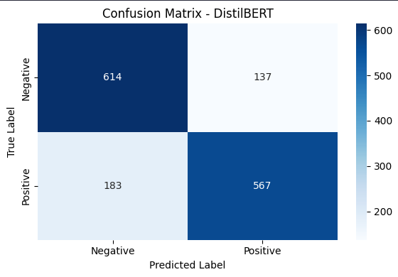

_Illustration – Courbe ROC :_  
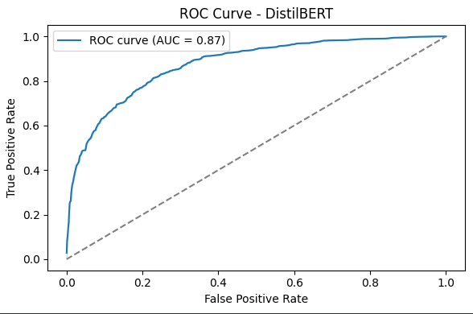

_Illustration – Récapitulatif complet dans MLflow :_  
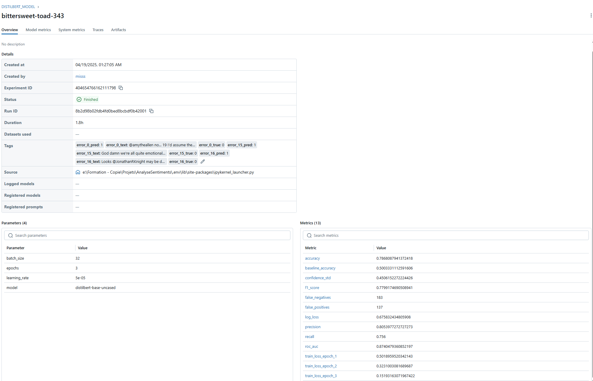

Ce modèle confirme la **supériorité des transformers** pour la classification de texte, même avec un entraînement limité à 3 époques, et justifie leur adoption dans les applications industrielles de NLP.

#### Synthèse des performances et limites des modèles

L’ensemble des modèles testés – allant de la **régression logistique TF-IDF**, aux réseaux **LSTM**, **CNN**, jusqu’à la fusion **CNN + LSTM**, puis **DistilBERT** – permet de mettre en lumière une évolution progressive des performances… mais aussi leurs limites respectives.

| Modèle                | F1-Score | Accuracy | AUC      |
| --------------------- | -------- | -------- | -------- |
| Dummy Classifier      | 0.50     | 0.50     | 0.50     |
| TF-IDF + LogReg       | 0.73     | 0.72     | 0.79     |
| LSTM + Word2Vec       | 0.61     | 0.54     | 0.58     |
| CNN + Word2Vec        | 0.63     | 0.59     | 0.64     |
| CNN + LSTM + FastText | 0.58     | 0.50     | 0.52     |
| **DistilBERT**        | **0.78** | **0.79** | **0.87** |

L’approche **TF-IDF + LogReg** surpasse tous les modèles de type séquentiel classiques (LSTM, CNN) en précision et en stabilité, probablement grâce à sa simplicité et à sa meilleure capacité à généraliser avec des données limitées. Les architectures profondes comme LSTM et CNN, bien que théoriquement adaptées au texte, peinent à extraire des signaux robustes ici, souvent freinées par le manque de volume ou de qualité sémantique du dataset.  

L’**arrivée de DistilBERT** change la donne :  

- `f1_score = 0.78`  
- `accuracy = 0.79`  
- `roc_auc = 0.87`  
- `precision = 0.81`  
- `recall = 0.76`  
- `log_loss = 0.67`  
- `false_positives = 137`  
- `false_negatives = 183`

Grâce à sa compréhension contextuelle plus fine, **DistilBERT** capte les nuances du langage avec une **supériorité nette** sur les autres modèles. La réduction drastique des erreurs, notamment des faux positifs, témoigne de son efficacité.

 _Illustration – Comparatif global (1/2) :_  
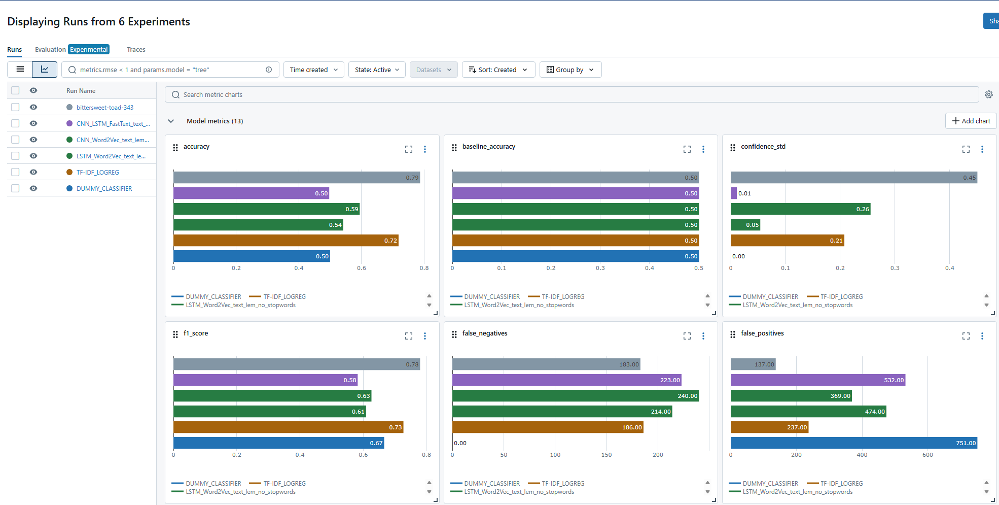

 _Illustration – Comparatif global (2/2) :_  
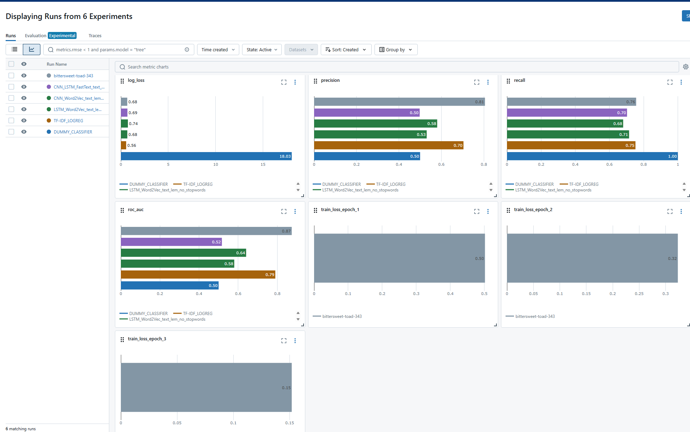

---

### Ouverture – Les erreurs de DistilBERT : un défi sémantique

Malgré sa performance impressionnante, DistilBERT n’est pas infaillible. L’analyse des **erreurs enregistrées dans MLflow** met en évidence un type d’ambiguïté récurrent :  

> Des phrases contenant du **sarcasme**, de la **dérision** ou des tournures humoristiques échappent au modèle.

 _Exemples d’erreurs typiques_ :

- _"New fave..bad girlfriend theory of a dead man..ck it out"_
- _"Dying in lines with tamttity, joe, and dylan. MTVMA party "_
- _"Thankfully there’s Stanley Cup hockey on to help ease my bummed out mood."_

Ces exemples illustrent le **manque de discernement sur le ton** du message : un problème bien connu des modèles NLP, même avancés. Le texte semble positif en surface, mais le **sous-texte émotionnel** est en réalité **négatif**.

_Illustration – Analyse des erreurs de BERT :_  
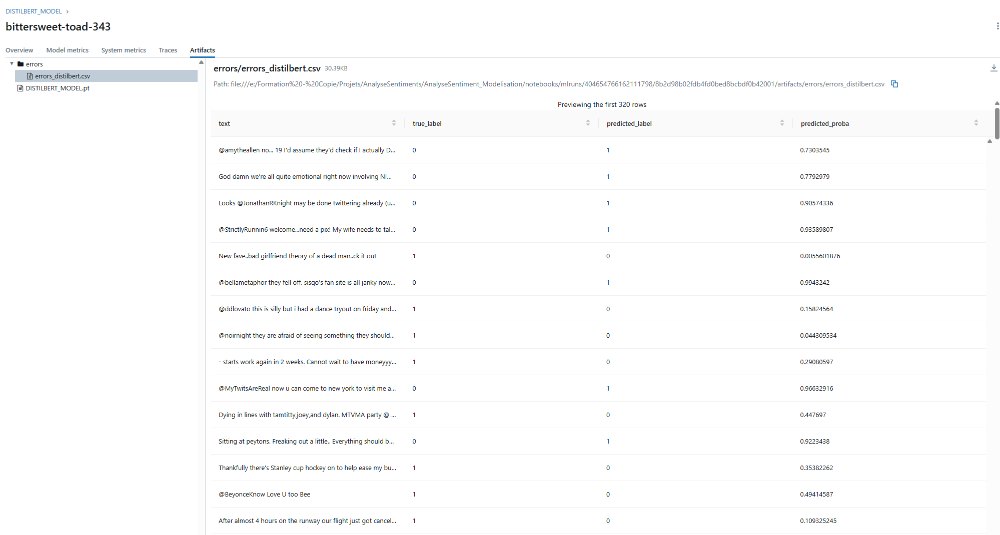

---

 Une **piste d’amélioration** serait d’enrichir le jeu de données avec des labels contextuels (ex. : sarcasme, ironie, émotion dominante) ou de coupler BERT à un détecteur de tonalité ou d’intention, ouvrant vers des **modèles multimodaux** ou des **architectures spécialisées en pragmatique du langage**.

---

## Démarche MLOps mise en œuvre

### Principes généraux

Dans ce projet, l’approche MLOps permet de structurer le cycle de vie du modèle de classification de sentiment, de l’expérimentation jusqu’au suivi en production.

Les objectifs sont les suivants :

- **Reproductibilité** : pouvoir relancer les entraînements et obtenir les mêmes résultats
- **Traçabilité** : conserver l’historique des essais, des métriques et des versions de modèles
- **Fiabilité** : tester automatiquement les composants critiques
- **Automatisation** : déploiement reproductible via Docker, hébergement cloud
- **Observabilité** : supervision en production, alertes sur dérives ou erreurs
- **Amélioration continue** : collecte de feedbacks utilisateurs pour affiner le modèle

Ces principes ont guidé la mise en œuvre technique décrite dans les sous-sections suivantes.

### Cycle MLOps du projet

Le schéma suivant illustre la **vision globale du cycle MLOps** mise en place dans le projet.  
On y retrouve les phases principales allant du développement à la mise en production, en passant par la validation, la surveillance et une proposition de boucle d'amélioration continue.


### Suivi des expérimentations

Toutes les expérimentations ont été suivies à l’aide de **MLflow**, un outil open source de gestion du cycle de vie des modèles de machine learning.

Nous avons utilisé **MLflow Tracking** pour enregistrer :

- Les **hyperparamètres** (par exemple `max_features`, `model_type`, etc.)
- Les **scores de performance** (accuracy, F1-score, etc.)
- Les **artéfacts** tels que les modèles entraînés, les tokenizers, et les logs
- Les **tags** permettant de regrouper ou filtrer des essais par type de modèle ou objectif

Chaque exécution (`run`) est associée à un identifiant unique, une date, et une version du code, ce qui permet de revenir en arrière ou de reproduire un résultat à tout moment.

L’interface web de MLflow a également permis de comparer visuellement les résultats des différents modèles :

- Comparaison de courbes de performances
- Tri des runs par métriques
- Récupération directe des modèles les plus performants

Cette traçabilité a été essentielle pour identifier la meilleure approche à déployer en production.

### Versionnement et stockage des modèles

Dans ce projet, le **versionnement du code source et du modèle** a été assuré uniquement via **Git**, ce qui s'est avéré suffisant grâce à la légèreté du modèle final utilisé (format `.tflite`).

Contrairement à une architecture MLOps complète avec stockage cloud (Blob Storage, S3, etc.), nous avons choisi une approche plus simple mais efficace : le modèle final est intégré directement dans le dépôt du projet, aux côtés du tokenizer.

Ce choix est rendu possible grâce à l’utilisation de **TensorFlow Lite**, qui génère un modèle compressé facile à embarquer dans une API ou un conteneur Docker, sans compromettre les performances.

Les expérimentations ont quant à elles été suivies via **MLflow**, mais **le stockage et le déploiement du modèle retenu** reposent uniquement sur le versionnement Git.  
Cela garantit une bonne traçabilité tout en limitant la complexité d’infrastructure.

**Résumé** :

- ✅ Code versionné avec Git
- ✅ Modèle `.tflite` lightweight versionné dans le dépôt
- ✅ MLflow utilisé pour la comparaison des expérimentations, pas pour le déploiement

---

### Tests unitaires

Des tests unitaires ont été mis en place afin de garantir la fiabilité du modèle de classification avant sa mise en production. Ces tests ont été conçus pour valider les points critiques du pipeline d'inférence. Ils sont regroupés dans un répertoire `tests/` et exécutés avec **pytest**.

Trois tests principaux ont été définis :

1. **Test de prédiction positive**  
   Ce test vérifie que le modèle est capable d’identifier correctement un texte clairement positif.  
   Il confirme que la prédiction retournée est bien `1` et que la sortie respecte le bon format (`list` contenant un `int`).

2. **Test de prédiction négative**  
   Similaire au test précédent, il vérifie que le modèle retourne `0` pour une phrase négative.  
   Il permet de s’assurer du comportement attendu sur les cas simples.

3. **Test de robustesse sur un lot de phrases**  
   Le modèle est testé sur plusieurs exemples positifs et négatifs, avec une vérification du taux de bonnes prédictions.  
   Ce test permet de valider la stabilité du modèle sur des entrées variées.

Ces tests sont automatiquement exécutés à chaque **pull request** via une **action GitHub**. Cela permet de valider les modifications avant intégration.

Bien que la version gratuite de GitHub ne permette pas de bloquer une fusion en cas d’échec, cette pratique est essentielle en contexte professionnel, où les workflows peuvent être configurés comme **bloquants** (CI obligatoire avant merge).

Voici deux captures d'écran illustrant cette intégration :

#### Aperçu des exécutions de workflow GitHub Actions


#### Exemple de rapport de tests exécutés avec `pytest`


Cette stratégie permet de sécuriser la phase de développement, de détecter rapidement les erreurs, et de favoriser une meilleure qualité de code dans le temps.

---

### Architecture applicative déployée sur Azure

Le diagramme suivant présente les différents composants du projet et leur interaction entre la **partie locale (frontend Streamlit)** et l’**infrastructure cloud (API déployée, Application Insights, alerting)**.

On y visualise :

- Le fonctionnement du front local en interaction avec l’API (`/predict` et `/feedback`)
- Le traitement de ces requêtes via le container Azure
- La journalisation des feedbacks dans Application Insights
- Le système d’alerte déclenché en cas d’erreurs répétées


---

### Déploiement de l’API

L’API a été développée avec **FastAPI**, un framework léger et rapide pour créer des services web en Python. Elle expose deux endpoints : `/predict` pour la prédiction de sentiment, et `/feedback` pour la collecte de retour utilisateur.  
Une fois testée en local, elle a été conteneurisée puis déployée sur Azure.

#### Conteneurisation avec Docker

L’ensemble du projet (API, modèle TFLite, tokenizer) est empaqueté dans une image Docker.  
Cela garantit une exécution reproductible en local comme en cloud. Les dépendances sont définies dans un fichier `requirements-api.txt`.

Avant de procéder au déploiement sur Azure, il est possible de tester l’API **en local** à l’aide des commandes suivantes :

```bash
# Construction de l’image Docker
docker build -t sentiment-api .

# Lancement du conteneur localement
docker run -p 8000:8000 sentiment-api
```

Une fois le conteneur lancé, l’API est accessible à l’adresse suivante dans le navigateur :

```
http://localhost:8000/docs
```

Cela permet de tester les endpoints `/predict` et `/feedback` via Swagger, comme si elle était déjà en ligne.

L’image est ensuite poussée dans un **container registry Azure** et déployée automatiquement via GitHub Actions.


---

#### Déploiement sur Azure Container Apps

L’image est déployée dans **Azure Container Apps**, un service managé qui permet d’exécuter l’API sans gérer de VM.  
Cette solution assure la scalabilité automatique, un monitoring natif et une intégration facile avec Application Insights.


#### Endpoints disponibles et testables

Une fois l’API déployée, elle est accessible publiquement et peut être testée via l’interface Swagger générée automatiquement par FastAPI.

Voici les endpoints disponibles :

- `/predict` : reçoit une chaîne de caractères et retourne une prédiction (`0` ou `1`)
- `/feedback` : enregistre le feedback utilisateur sur une prédiction


#### Exemple d’appel à `/predict`

```json
{
  "text": "string"
}
```


#### Exemple d’appel à `/feedback`

```json
{
  "texte": "string",
  "prediction": 0,
  "feedback_correct": true
}
```


Ce déploiement permet de rendre le modèle disponible à des utilisateurs externes, tout en facilitant la supervision et les mises à jour grâce à la conteneurisation et à l’automatisation des workflows.

---

### Interface front de test (locale)

Pour permettre une évaluation simple de l’API sans passer par des outils externes, une interface utilisateur légère a été développée avec **Streamlit**.

Ce front-end n’est pas déployé sur le cloud, mais peut être lancé localement pour :

- Tester le comportement du modèle (`/predict`)
- Visualiser la prédiction sous forme lisible (positif/négatif)
- Soumettre un retour utilisateur (`/feedback`)
- Envoyer les feedbacks en un clic

#### Fonctionnement

L’utilisateur entre un message libre dans un champ texte, clique sur "Analyser le sentiment", et obtient une réponse immédiate.  
Il peut ensuite valider ou invalider la prédiction via une interface radio + bouton, ce qui déclenche l’appel au second endpoint.

Voici quelques captures d’écran illustrant le parcours :

- Interface au démarrage :

  

- Exemple de prédiction négative avec retour utilisateur :

    
  

- Exemple de prédiction positive :

  

#### Lancement local

Le front est accessible uniquement localement.  
Pour le démarrer :

```bash
streamlit run app.py
```

Cela ouvre automatiquement l’application dans le navigateur à l’adresse suivante :

```
http://localhost:8501
```

Il est également possible de personnaliser les endpoints dans le code pour pointer vers une instance distante, mais ce front a été conçu principalement à des fins de test.

**Résumé :**

- Développé avec Streamlit
- Permet de tester `/predict` et `/feedback`
- Lancement simple en local
- Non déployé dans le cloud

---

### Monitoring et alertes

Une fois l’API déployée dans Azure Container Apps, il est essentiel d’assurer un suivi en production pour détecter les erreurs, suivre l’usage, et alimenter une boucle de retour pour améliorer le modèle.

Le projet utilise **Azure Application Insights**, intégré via la bibliothèque `azure-monitor-opentelemetry` dans le backend FastAPI.

#### Logs et suivi applicatif

À chaque appel à l’API, des logs personnalisés sont envoyés à Application Insights, notamment lors de la réception de feedback utilisateur.  
Ces logs incluent les champs essentiels : texte, prédiction retournée, retour utilisateur, erreurs éventuelles, etc.

Voici un aperçu de l’environnement Application Insights :


Des tableaux de bord peuvent être créés pour visualiser l'activité des endpoints, les fréquences d’appels et les erreurs :

  
  
  


#### Mise en place des alertes

Des **règles d’alerte** sont configurées à partir des logs collectés. Cela permet d’être notifié si une anomalie est détectée.

Exemples de règles mises en place :

- Erreurs fréquentes sur l’API
- Trop grand nombre de feedbacks négatifs sur une période donnée

Exemples de notifications envoyées par mail :

  
  


Exemples de règles dans Azure :

  


#### Cas d’usage : boucle de feedback

Chaque retour utilisateur est consigné et analysable. Ces données permettent :

- D’identifier des prédictions incorrectes
- D’alimenter un futur jeu de données pour l’amélioration du modèle
- De déclencher des retrainings ciblés

Cela alimente une **démarche de model monitoring** et d'amélioration continue.

**Résumé :**

- Logs envoyés automatiquement vers Azure Application Insights
- Tableaux de bord de suivi en temps réel (Workbook)
- Alertes configurées en cas de dérives
- Notifications email opérationnelles
- Données prêtes pour l’analyse et l’amélioration du modèle

---

### Proposition de démarche pour l'amélioration continue du modèle

Bien que le projet n’intègre pas encore de pipeline automatisé de réentraînement, une **démarche d’amélioration continue** pourrait être mise en place à partir des éléments déjà existants (API en production, retours utilisateurs, logs centralisés).

Voici les grandes étapes d’une telle stratégie :

#### 1. Collecte automatisée des feedbacks

L’API `/feedback` permet déjà de récupérer l’évaluation de la prédiction par l’utilisateur (feedback correct ou non).  
Ces données peuvent être stockées dans une base dédiée ou extraites régulièrement depuis Application Insights.

#### 2. Création d’un jeu de données complémentaire

Les retours utilisateurs où la prédiction était incorrecte (feedback négatif) peuvent être utilisés pour enrichir le jeu d’entraînement.  
Cette base peut être filtrée, nettoyée, puis intégrée à une version 2 du dataset.

#### 3. Réentraînement périodique

Un pipeline de réentraînement pourrait être exécuté de manière :

- Manuelle (ex. via script Python déclenché chaque mois)
- Ou automatisée (ex. via GitHub Actions ou Azure Machine Learning)

L’idée serait de recharger le modèle avec :

- Le dataset initial
- - les retours utilisateurs corrigés
- - éventuellement des pondérations pour les cas difficiles

#### 4. Réévaluation et traçabilité

Chaque nouveau modèle peut être :

- Comparé à l'ancien via MLflow
- Versionné avec un identifiant clair
- Testé automatiquement avant mise en production

#### 5. Déploiement contrôlé

Une fois validé, le modèle mis à jour peut être déployé via Docker + CI/CD, comme dans la version actuelle.  
Un tag (`v2`, `v3`, etc.) permettrait de suivre les évolutions dans le temps.

#### 6. Boucle d’apprentissage continue

Ce mécanisme permettrait d’implémenter une **boucle vertueuse**, où :

- L’usage réel de l’API alimente le dataset
- Le modèle est continuellement ajusté
- La performance en production s’améliore au fil du temps

Cette stratégie constitue une base solide pour aller vers une vraie démarche de **“continuous learning”**, souvent recherchée dans les contextes industriels ou à forte évolution sémantique.

---

## Conclusion

Ce projet de classification de sentiments s’est appuyé sur une approche structurée mêlant data science, développement API, et bonnes pratiques de MLOps.

Trois modèles ont été testés, comparés et évalués afin d’identifier la solution la plus performante et la plus légère à déployer (un modèle DistilBERT exporté en TensorFlow Lite).  
Un soin particulier a été apporté à la **traçabilité des expérimentations**, au **versionnement**, à la **mise en production via Docker et Azure**, ainsi qu’à la **mise en place de tests automatisés** pour garantir la qualité du code.

L’**intégration d’Azure Application Insights** a permis un suivi fin des appels à l’API, avec des alertes configurables, offrant ainsi les bases d’une véritable observabilité en production.

Enfin, une **démarche projetée d’amélioration continue** a été esquissée, afin d’exploiter les feedbacks utilisateurs collectés et d’envisager des mises à jour futures du modèle de manière contrôlée.

Ce travail montre qu’il est possible, même avec des ressources limitées, de mettre en place une chaîne de traitement de machine learning complète, fiable, et prête pour des évolutions futures en production.
