# Comparaison des approches de classification et démarche MLOps

_Auteur : JEAN BAPTISTE Joëlle_  
_Date : Avril 2025_

---

## Table des matières

- [Introduction](#introduction)
- [Présentation et comparaison des modèles](#présentation-et-comparaison-des-modèles)
  - [Modèle sur mesure simple](#modèle-sur-mesure-simple)
  - [Modèle sur mesure avancé](#modèle-sur-mesure-avancé)
  - [Modèle avancé BERT](#modèle-avancé-bert)
- [Démarche MLOps mise en œuvre](#démarche-mlops-mise-en-œuvre)
  - [Principes généraux](#principes-généraux)
  - [Cycle MLOps du projet](#cycle-mlops-du-projet)
  - [Suivi des expérimentations](#suivi-des-expérimentations)
  - [Tests unitaires](#tests-unitaires)
  - [Architecture applicative déployée sur Azure](#architecture-applicative-déployée-sur-azure)
  - [Déploiement de l’API](#déploiement-de-lapi)
  - [Interface front de test (locale)](#interface-front-de-test-locale)
  - [Monitoring et alertes](#monitoring-et-alertes)
- [Proposition de démarche pour l'amélioration continue du modèle](#proposition-de-démarche-pour-lamélioration-continue-du-modèle)
- [Conclusion](#conclusion)

---

### 🔗 Liens vers les dépôts du projet

- 💻 **Backend (API FastAPI + modèle TFLite + déploiement Azure)**  
  [https://github.com/joelle-jnbaptiste/Analyse_Sentiments](https://github.com/joelle-jnbaptiste/Analyse_Sentiments)

- 🧪 **Frontend (Interface de test locale en Streamlit)**  
  [https://github.com/joelle-jnbaptiste/FrontAnalyseSentiment](https://github.com/joelle-jnbaptiste/FrontAnalyseSentiment)

---

## Introduction

Dans le cadre de ce projet, nous avons conçu et comparé plusieurs approches de classification de sentiments afin d'évaluer leur pertinence en situation réelle.  
L’objectif était double : évaluer les performances de différents types de modèles — du plus simple au plus avancé — et mettre en place une démarche MLOps complète garantissant un suivi, une reproductibilité et une amélioration continue du modèle en production.

Trois approches ont été étudiées :

- Un modèle sur mesure simple, basé sur des techniques classiques de vectorisation et de classification.
- Un modèle sur mesure avancé, intégrant des méthodes d’apprentissage plus complexes.
- Un modèle avancé basé sur BERT, une architecture de type Transformer pré-entraînée, convertie ici au format TFLite pour faciliter son déploiement.

Pour accompagner ces expérimentations, une architecture orientée MLOps a été mise en place, intégrant le tracking des modèles via MLflow, le déploiement via Docker et Azure Container Apps, ainsi que le monitoring et les alertes via Azure Application Insights.

Ce document présente la démarche, les résultats de comparaison des modèles et la manière dont les principes MLOps ont été appliqués à ce projet.

---

## Présentation et comparaison des modèles

### Modèle sur mesure simple

Description : TF-IDF + régression logistique  
**Avantages** : rapide, simple à mettre en place, interprétable  
**Inconvénients** : faible généralisation, moins performant

### Modèle sur mesure avancé

Exemple : TF-IDF + Random Forest, ou réseau de neurones simple  
**Avantages** : meilleure performance, prise en compte non-linéarité  
**Inconvénients** : plus de calcul, tuning plus complexe

### Modèle avancé BERT

Utilisation de `DistilBERT` avec conversion en TFLite.  
**Avantages** : très bonne précision, transfert learning  
**Inconvénients** : lourd, plus difficile à déployer


---

## Démarche MLOps mise en œuvre

### Principes généraux

Dans ce projet, l’approche MLOps permet de structurer le cycle de vie du modèle de classification de sentiment, de l’expérimentation jusqu’au suivi en production.

Les objectifs sont les suivants :

- **Reproductibilité** : pouvoir relancer les entraînements et obtenir les mêmes résultats
- **Traçabilité** : conserver l’historique des essais, des métriques et des versions de modèles
- **Fiabilité** : tester automatiquement les composants critiques
- **Automatisation** : déploiement reproductible via Docker, hébergement cloud
- **Observabilité** : supervision en production, alertes sur dérives ou erreurs
- **Amélioration continue** : collecte de feedbacks utilisateurs pour affiner le modèle

Ces principes ont guidé la mise en œuvre technique décrite dans les sous-sections suivantes.

### Cycle MLOps du projet

Le schéma suivant illustre la **vision globale du cycle MLOps** mise en place dans le projet.  
On y retrouve les phases principales allant du développement à la mise en production, en passant par la validation, la surveillance et une proposition de boucle d'amélioration continue.

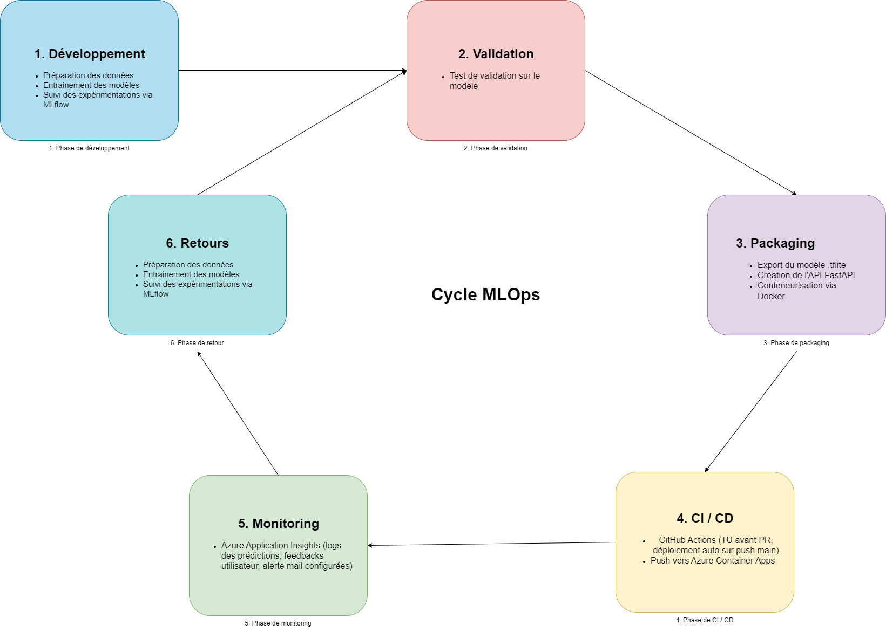

### Suivi des expérimentations

Toutes les expérimentations ont été suivies à l’aide de **MLflow**, un outil open source de gestion du cycle de vie des modèles de machine learning.

Nous avons utilisé **MLflow Tracking** pour enregistrer :

- Les **hyperparamètres** (par exemple `max_features`, `model_type`, etc.)
- Les **scores de performance** (accuracy, F1-score, etc.)
- Les **artéfacts** tels que les modèles entraînés, les tokenizers, et les logs
- Les **tags** permettant de regrouper ou filtrer des essais par type de modèle ou objectif

Chaque exécution (`run`) est associée à un identifiant unique, une date, et une version du code, ce qui permet de revenir en arrière ou de reproduire un résultat à tout moment.

L’interface web de MLflow a également permis de comparer visuellement les résultats des différents modèles :

- Comparaison de courbes de performances
- Tri des runs par métriques
- Récupération directe des modèles les plus performants

Voici un exemple de capture d’écran d’un run MLflow :


Cette traçabilité a été essentielle pour identifier la meilleure approche à déployer en production.

### Versionnement et stockage des modèles

Dans ce projet, le **versionnement du code source et du modèle** a été assuré uniquement via **Git**, ce qui s'est avéré suffisant grâce à la légèreté du modèle final utilisé (format `.tflite`).

Contrairement à une architecture MLOps complète avec stockage cloud (Blob Storage, S3, etc.), nous avons choisi une approche plus simple mais efficace : le modèle final est intégré directement dans le dépôt du projet, aux côtés du tokenizer.

Ce choix est rendu possible grâce à l’utilisation de **TensorFlow Lite**, qui génère un modèle compressé facile à embarquer dans une API ou un conteneur Docker, sans compromettre les performances.

Les expérimentations ont quant à elles été suivies via **MLflow**, mais **le stockage et le déploiement du modèle retenu** reposent uniquement sur le versionnement Git.  
Cela garantit une bonne traçabilité tout en limitant la complexité d’infrastructure.

**Résumé** :

- ✅ Code versionné avec Git
- ✅ Modèle `.tflite` lightweight versionné dans le dépôt
- ✅ MLflow utilisé pour la comparaison des expérimentations, pas pour le déploiement

---

### Tests unitaires

Des tests unitaires ont été mis en place afin de garantir la fiabilité du modèle de classification avant sa mise en production. Ces tests ont été conçus pour valider les points critiques du pipeline d'inférence. Ils sont regroupés dans un répertoire `tests/` et exécutés avec **pytest**.

Trois tests principaux ont été définis :

1. **Test de prédiction positive**  
   Ce test vérifie que le modèle est capable d’identifier correctement un texte clairement positif.  
   Il confirme que la prédiction retournée est bien `1` et que la sortie respecte le bon format (`list` contenant un `int`).

2. **Test de prédiction négative**  
   Similaire au test précédent, il vérifie que le modèle retourne `0` pour une phrase négative.  
   Il permet de s’assurer du comportement attendu sur les cas simples.

3. **Test de robustesse sur un lot de phrases**  
   Le modèle est testé sur plusieurs exemples positifs et négatifs, avec une vérification du taux de bonnes prédictions.  
   Ce test permet de valider la stabilité du modèle sur des entrées variées.

Ces tests sont automatiquement exécutés à chaque **pull request** via une **action GitHub**. Cela permet de valider les modifications avant intégration.

Bien que la version gratuite de GitHub ne permette pas de bloquer une fusion en cas d’échec, cette pratique est essentielle en contexte professionnel, où les workflows peuvent être configurés comme **bloquants** (CI obligatoire avant merge).

Voici deux captures d'écran illustrant cette intégration :

#### Aperçu des exécutions de workflow GitHub Actions

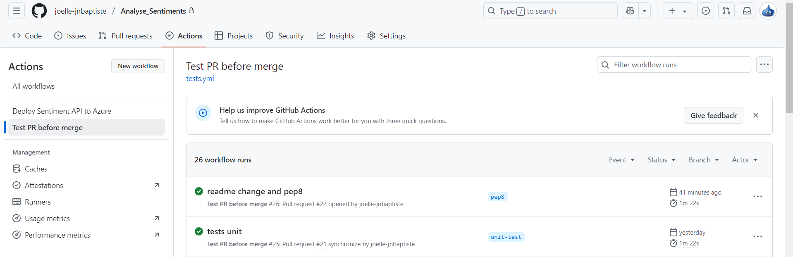

#### Exemple de rapport de tests exécutés avec `pytest`


Cette stratégie permet de sécuriser la phase de développement, de détecter rapidement les erreurs, et de favoriser une meilleure qualité de code dans le temps.

---

### Architecture applicative déployée sur Azure

Le diagramme suivant présente les différents composants du projet et leur interaction entre la **partie locale (frontend Streamlit)** et l’**infrastructure cloud (API déployée, Application Insights, alerting)**.

On y visualise :

- Le fonctionnement du front local en interaction avec l’API (`/predict` et `/feedback`)
- Le traitement de ces requêtes via le container Azure
- La journalisation des feedbacks dans Application Insights
- Le système d’alerte déclenché en cas d’erreurs répétées

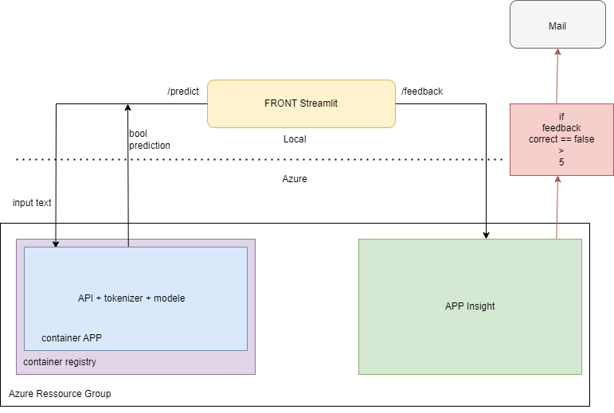

---

### Déploiement de l’API

L’API a été développée avec **FastAPI**, un framework léger et rapide pour créer des services web en Python. Elle expose deux endpoints : `/predict` pour la prédiction de sentiment, et `/feedback` pour la collecte de retour utilisateur.  
Une fois testée en local, elle a été conteneurisée puis déployée sur Azure.

#### Conteneurisation avec Docker

L’ensemble du projet (API, modèle TFLite, tokenizer) est empaqueté dans une image Docker.  
Cela garantit une exécution reproductible en local comme en cloud. Les dépendances sont définies dans un fichier `requirements-api.txt`.

Avant de procéder au déploiement sur Azure, il est possible de tester l’API **en local** à l’aide des commandes suivantes :

```bash
# Construction de l’image Docker
docker build -t sentiment-api .

# Lancement du conteneur localement
docker run -p 8000:8000 sentiment-api
```

Une fois le conteneur lancé, l’API est accessible à l’adresse suivante dans le navigateur :

```
http://localhost:8000/docs
```

Cela permet de tester les endpoints `/predict` et `/feedback` via Swagger, comme si elle était déjà en ligne.

L’image est ensuite poussée dans un **container registry Azure** et déployée automatiquement via GitHub Actions.

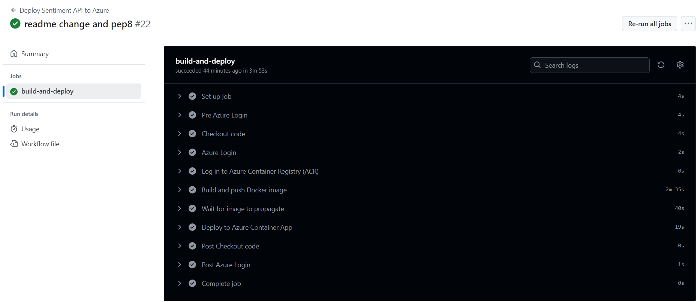

---

#### Déploiement sur Azure Container Apps

L’image est déployée dans **Azure Container Apps**, un service managé qui permet d’exécuter l’API sans gérer de VM.  
Cette solution assure la scalabilité automatique, un monitoring natif et une intégration facile avec Application Insights.

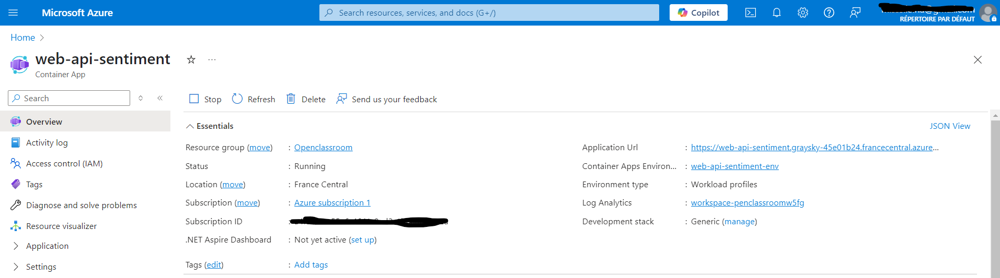

#### Endpoints disponibles et testables

Une fois l’API déployée, elle est accessible publiquement et peut être testée via l’interface Swagger générée automatiquement par FastAPI.

Voici les endpoints disponibles :

- `/predict` : reçoit une chaîne de caractères et retourne une prédiction (`0` ou `1`)
- `/feedback` : enregistre le feedback utilisateur sur une prédiction

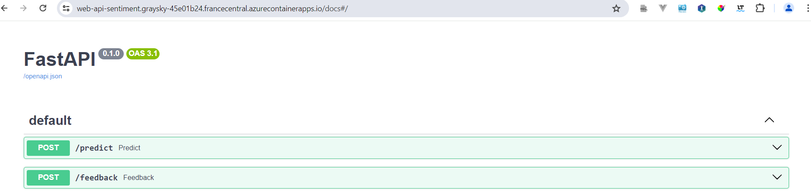

#### Exemple d’appel à `/predict`

```json
{
  "text": "string"
}
```

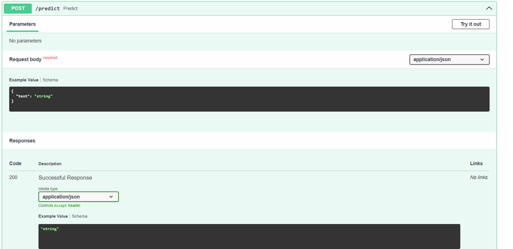

#### Exemple d’appel à `/feedback`

```json
{
  "texte": "string",
  "prediction": 0,
  "feedback_correct": true
}
```

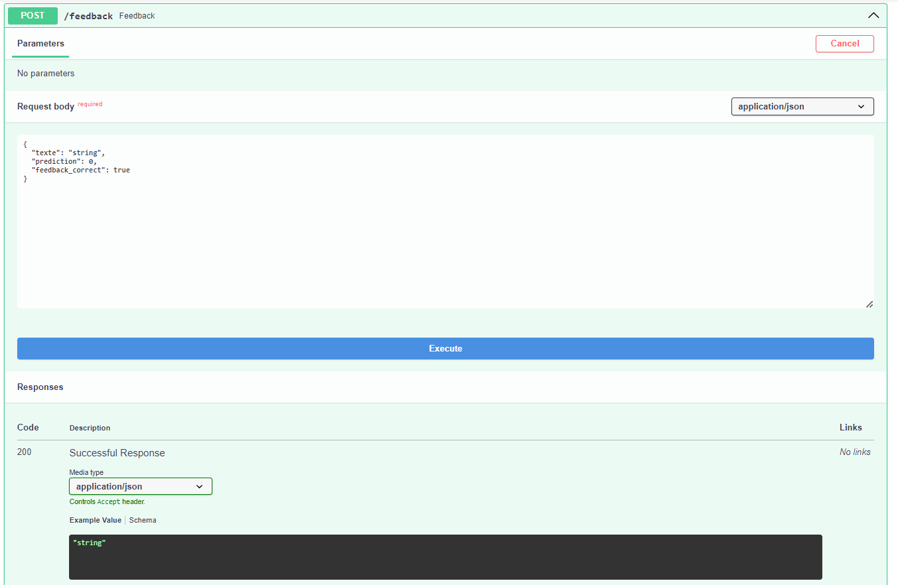

Ce déploiement permet de rendre le modèle disponible à des utilisateurs externes, tout en facilitant la supervision et les mises à jour grâce à la conteneurisation et à l’automatisation des workflows.

---

### Interface front de test (locale)

Pour permettre une évaluation simple de l’API sans passer par des outils externes, une interface utilisateur légère a été développée avec **Streamlit**.

Ce front-end n’est pas déployé sur le cloud, mais peut être lancé localement pour :

- Tester le comportement du modèle (`/predict`)
- Visualiser la prédiction sous forme lisible (positif/négatif)
- Soumettre un retour utilisateur (`/feedback`)
- Envoyer les feedbacks en un clic

#### Fonctionnement

L’utilisateur entre un message libre dans un champ texte, clique sur "Analyser le sentiment", et obtient une réponse immédiate.  
Il peut ensuite valider ou invalider la prédiction via une interface radio + bouton, ce qui déclenche l’appel au second endpoint.

Voici quelques captures d’écran illustrant le parcours :

- Interface au démarrage :

  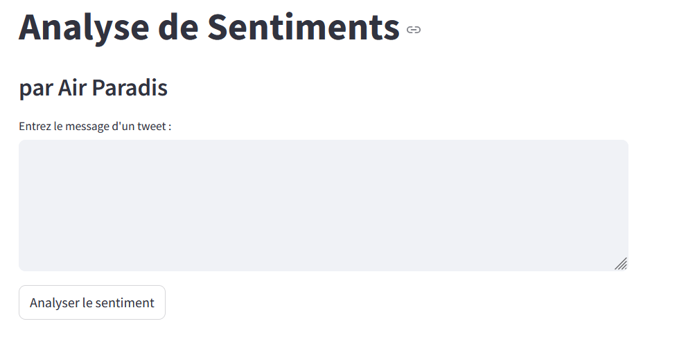

- Exemple de prédiction négative avec retour utilisateur :

  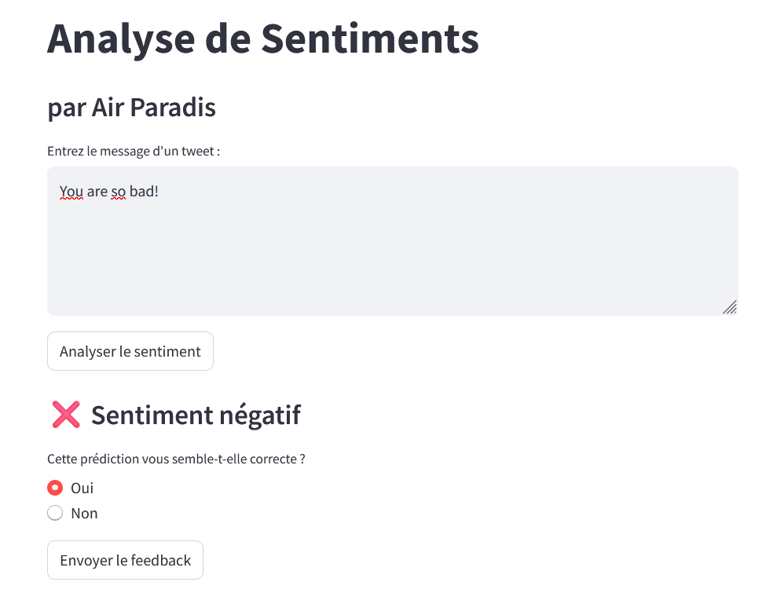  
  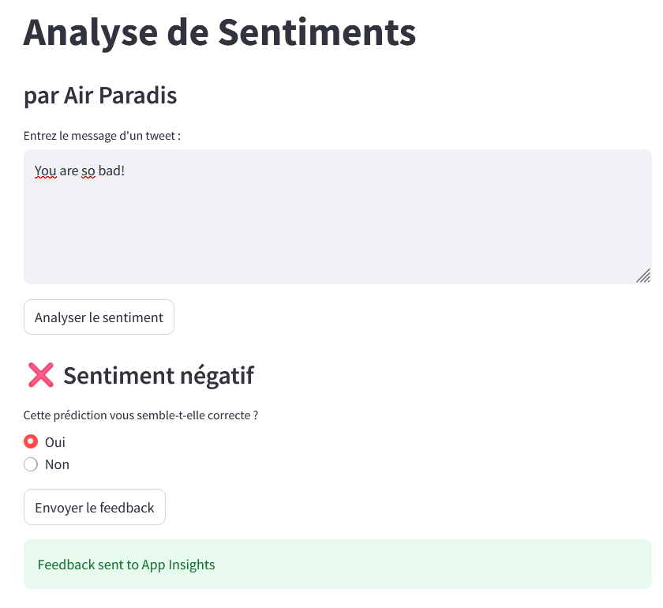

- Exemple de prédiction positive :

  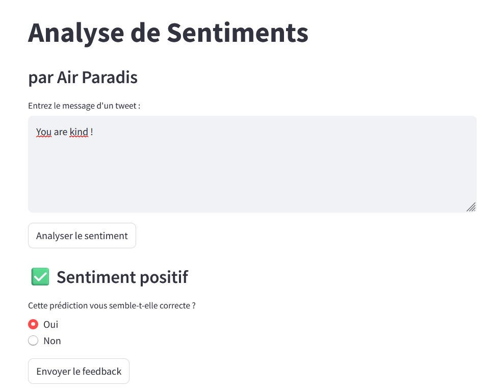

#### Lancement local

Le front est accessible uniquement localement.  
Pour le démarrer :

```bash
streamlit run app.py
```

Cela ouvre automatiquement l’application dans le navigateur à l’adresse suivante :

```
http://localhost:8501
```

Il est également possible de personnaliser les endpoints dans le code pour pointer vers une instance distante, mais ce front a été conçu principalement à des fins de test.

**Résumé :**

- Développé avec Streamlit
- Permet de tester `/predict` et `/feedback`
- Lancement simple en local
- Non déployé dans le cloud

---

### Monitoring et alertes

Une fois l’API déployée dans Azure Container Apps, il est essentiel d’assurer un suivi en production pour détecter les erreurs, suivre l’usage, et alimenter une boucle de retour pour améliorer le modèle.

Le projet utilise **Azure Application Insights**, intégré via la bibliothèque `azure-monitor-opentelemetry` dans le backend FastAPI.

#### Logs et suivi applicatif

À chaque appel à l’API, des logs personnalisés sont envoyés à Application Insights, notamment lors de la réception de feedback utilisateur.  
Ces logs incluent les champs essentiels : texte, prédiction retournée, retour utilisateur, erreurs éventuelles, etc.

Voici un aperçu de l’environnement Application Insights :

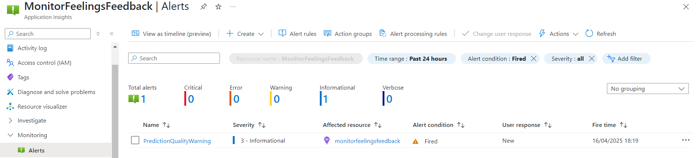

Des tableaux de bord peuvent être créés pour visualiser l'activité des endpoints, les fréquences d’appels et les erreurs :

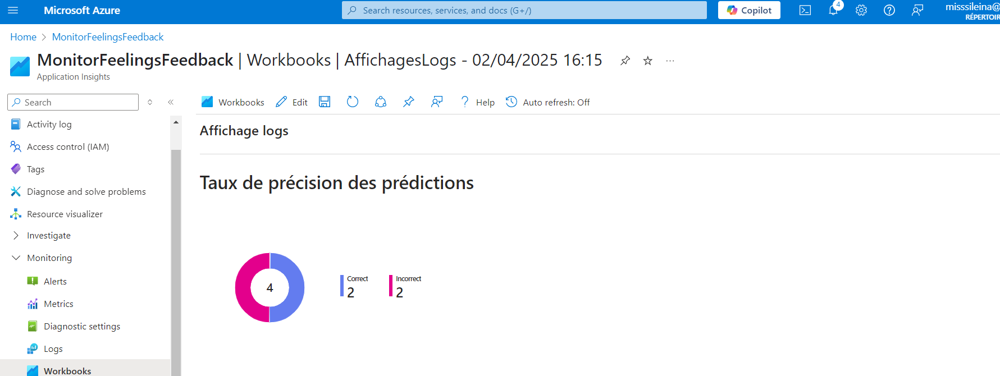  
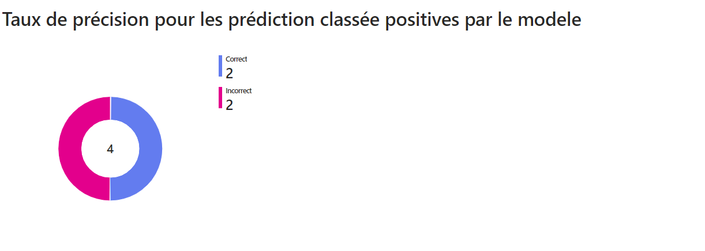  
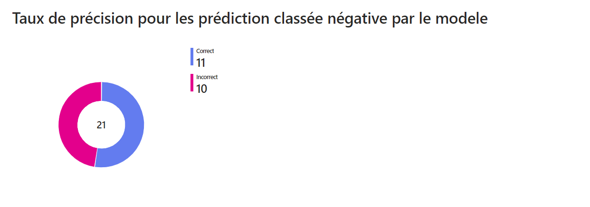  
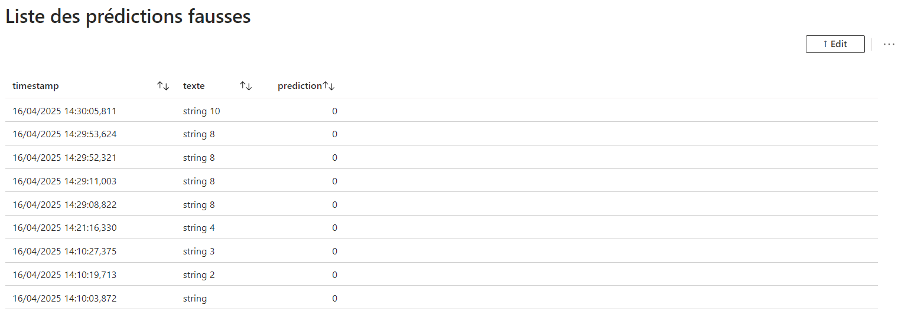

#### Mise en place des alertes

Des **règles d’alerte** sont configurées à partir des logs collectés. Cela permet d’être notifié si une anomalie est détectée.

Exemples de règles mises en place :

- Erreurs fréquentes sur l’API
- Trop grand nombre de feedbacks négatifs sur une période donnée

Exemples de notifications envoyées par mail :

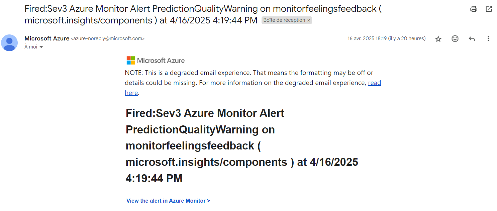  
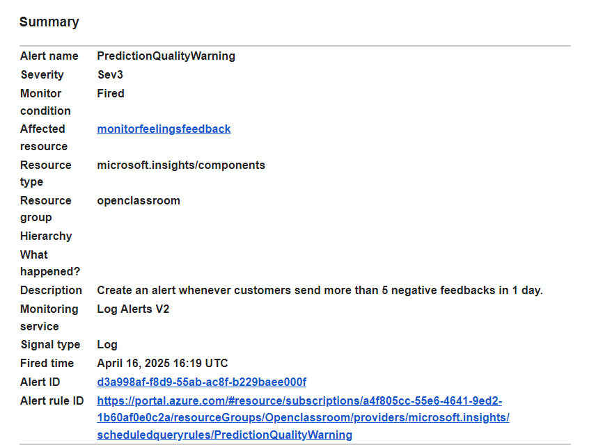  
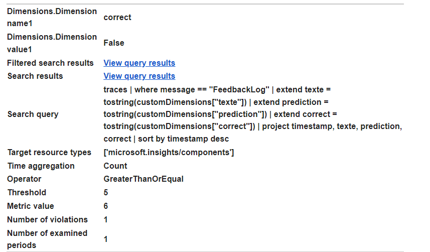

Exemples de règles dans Azure :

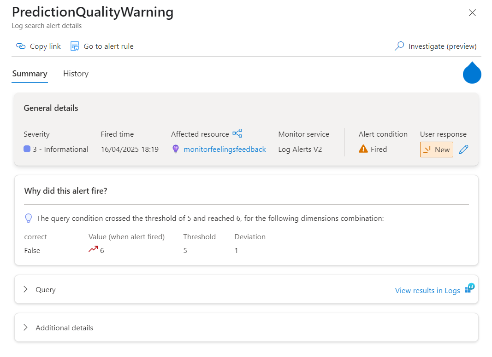  
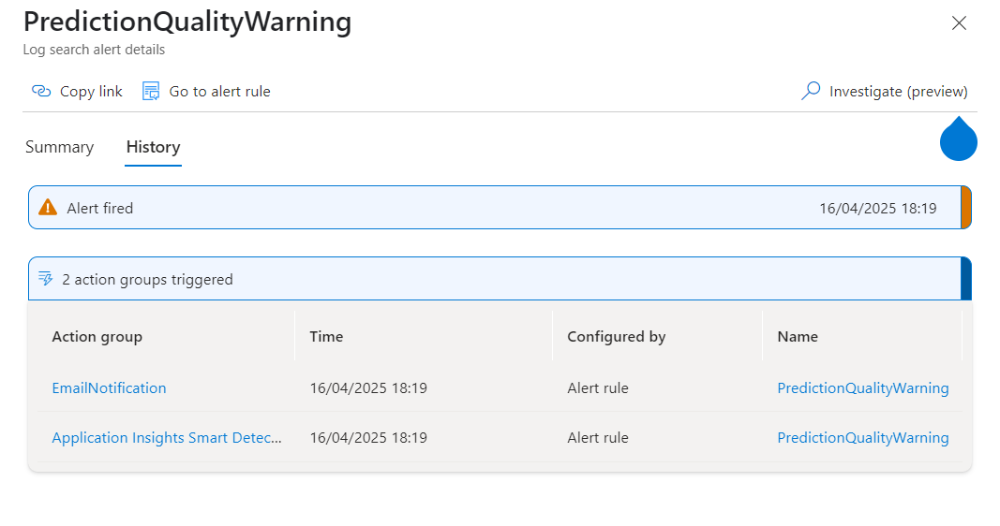

#### Cas d’usage : boucle de feedback

Chaque retour utilisateur est consigné et analysable. Ces données permettent :

- D’identifier des prédictions incorrectes
- D’alimenter un futur jeu de données pour l’amélioration du modèle
- De déclencher des retrainings ciblés

Cela alimente une **démarche de model monitoring** et d'amélioration continue.

**Résumé :**

- Logs envoyés automatiquement vers Azure Application Insights
- Tableaux de bord de suivi en temps réel (Workbook)
- Alertes configurées en cas de dérives
- Notifications email opérationnelles
- Données prêtes pour l’analyse et l’amélioration du modèle

---

### Proposition de démarche pour l'amélioration continue du modèle

Bien que le projet n’intègre pas encore de pipeline automatisé de réentraînement, une **démarche d’amélioration continue** pourrait être mise en place à partir des éléments déjà existants (API en production, retours utilisateurs, logs centralisés).

Voici les grandes étapes d’une telle stratégie :

#### 1. Collecte automatisée des feedbacks

L’API `/feedback` permet déjà de récupérer l’évaluation de la prédiction par l’utilisateur (feedback correct ou non).  
Ces données peuvent être stockées dans une base dédiée ou extraites régulièrement depuis Application Insights.

#### 2. Création d’un jeu de données complémentaire

Les retours utilisateurs où la prédiction était incorrecte (feedback négatif) peuvent être utilisés pour enrichir le jeu d’entraînement.  
Cette base peut être filtrée, nettoyée, puis intégrée à une version 2 du dataset.

#### 3. Réentraînement périodique

Un pipeline de réentraînement pourrait être exécuté de manière :

- Manuelle (ex. via script Python déclenché chaque mois)
- Ou automatisée (ex. via GitHub Actions ou Azure Machine Learning)

L’idée serait de recharger le modèle avec :

- Le dataset initial
- - les retours utilisateurs corrigés
- - éventuellement des pondérations pour les cas difficiles

#### 4. Réévaluation et traçabilité

Chaque nouveau modèle peut être :

- Comparé à l'ancien via MLflow
- Versionné avec un identifiant clair
- Testé automatiquement avant mise en production

#### 5. Déploiement contrôlé

Une fois validé, le modèle mis à jour peut être déployé via Docker + CI/CD, comme dans la version actuelle.  
Un tag (`v2`, `v3`, etc.) permettrait de suivre les évolutions dans le temps.

#### 6. Boucle d’apprentissage continue

Ce mécanisme permettrait d’implémenter une **boucle vertueuse**, où :

- L’usage réel de l’API alimente le dataset
- Le modèle est continuellement ajusté
- La performance en production s’améliore au fil du temps

Cette stratégie constitue une base solide pour aller vers une vraie démarche de **“continuous learning”**, souvent recherchée dans les contextes industriels ou à forte évolution sémantique.

---

## Conclusion

Ce projet de classification de sentiments s’est appuyé sur une approche structurée mêlant data science, développement API, et bonnes pratiques de MLOps.

Trois modèles ont été testés, comparés et évalués afin d’identifier la solution la plus performante et la plus légère à déployer (un modèle DistilBERT exporté en TensorFlow Lite).  
Un soin particulier a été apporté à la **traçabilité des expérimentations**, au **versionnement**, à la **mise en production via Docker et Azure**, ainsi qu’à la **mise en place de tests automatisés** pour garantir la qualité du code.

L’**intégration d’Azure Application Insights** a permis un suivi fin des appels à l’API, avec des alertes configurables, offrant ainsi les bases d’une véritable observabilité en production.

Enfin, une **démarche projetée d’amélioration continue** a été esquissée, afin d’exploiter les feedbacks utilisateurs collectés et d’envisager des mises à jour futures du modèle de manière contrôlée.

Ce travail montre qu’il est possible, même avec des ressources limitées, de mettre en place une chaîne de traitement de machine learning complète, fiable, et prête pour des évolutions futures en production.
